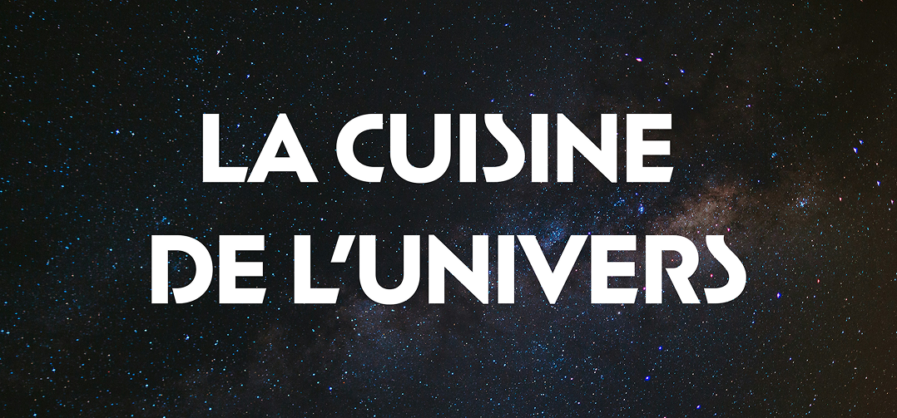
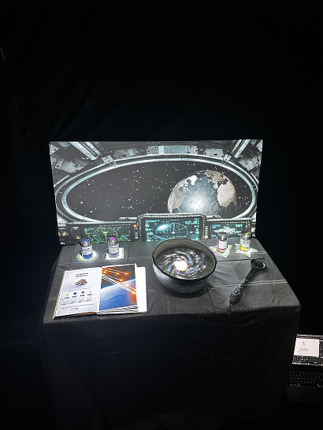
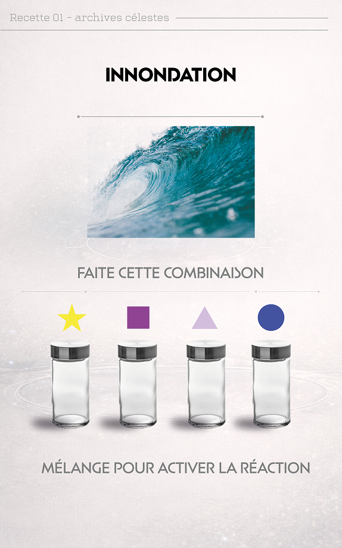
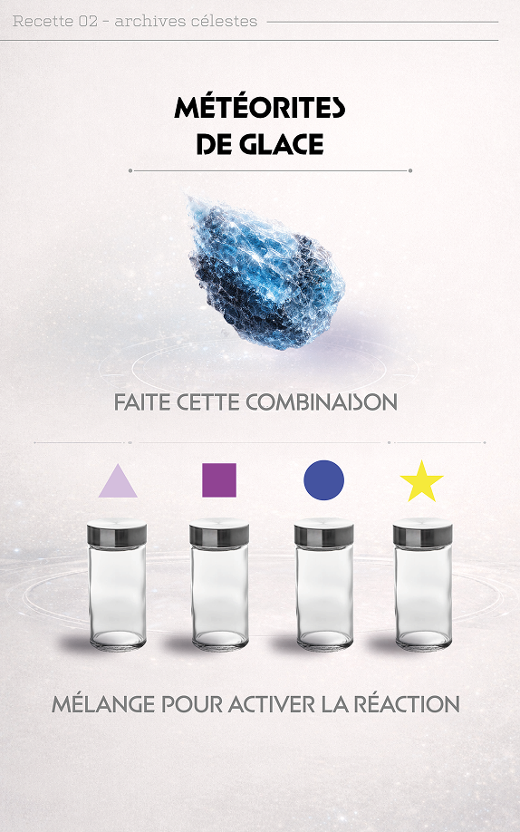
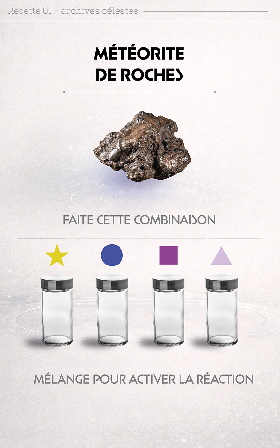
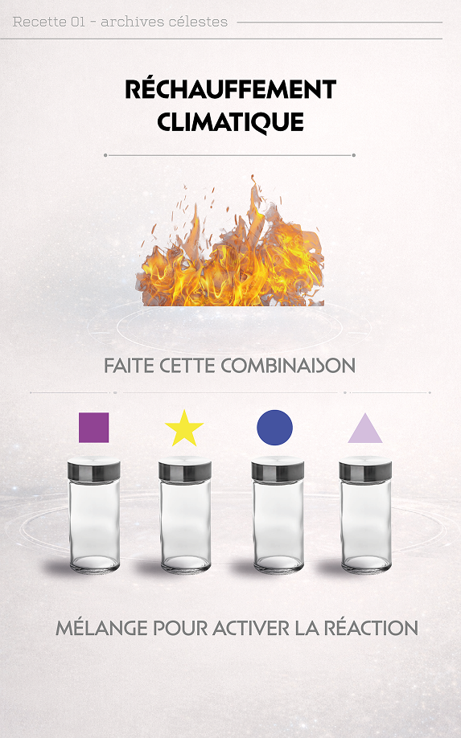
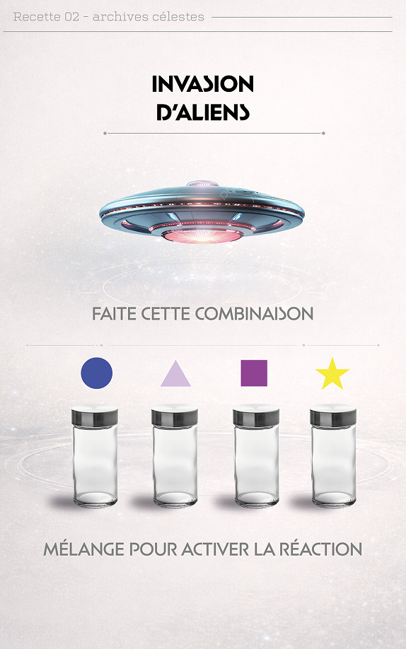
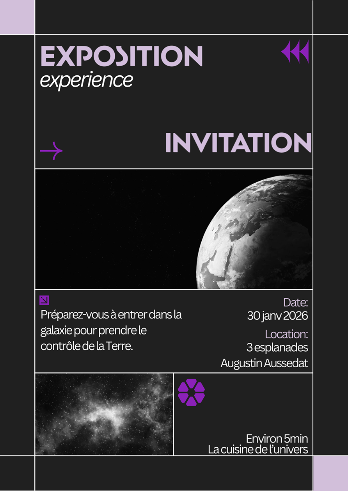

<div align="center">
  <h1>La Cuisine de l’Univers</h1>
  <br/>
  
  <br/><br/>
  <hr/>
</div>

## Sommaire
- [Pitch](#pitch)
- [Contexte du workshop](#contexte-du-workshop)
- [Expérience](#expérience)
- [Matériel](#matériel)
- [Technologies Utilisées](#technologies-utilisées)
- [Lancer le projet](#lancer-le-projet)
- [Galerie](#galerie)

## Pitch

**La Cuisine de l’Univers** est une expérience immersive et interactive de projection mapping qui rend l’ordinaire extraordinaire. Ici, l’ordinaire, c’est la cuisine.

Le visiteur devient, par accident, le remplaçant temporaire d’une entité cosmique chargée de maintenir l’équilibre de la Terre.

Tous les 100 ans, l’entité s’accorde une micro pause. Le visiteur arrive au mauvais moment et se retrouve propulsé en cuisine.

Dans un espace métamorphosé par projection en cuisine cosmique, la Terre devient une marmite instable. Autour, des objets physiques servent d’interfaces, une cuillère géante pour touiller, des pots d’épices pour ajuster des paramètres, un livre de recettes comme guide. Un assistant impose le tempo.

## Contexte du workshop

Projet réalisé dans le cadre d’un workshop mapping d’une semaine, 5 jours de travail effectif, avec 3 designers et 1 développeur.

Contraintes imposées :
- utilisation obligatoire de MadMapper
- un seul vidéoprojecteur maximum
- objectif, rendre l’ordinaire extraordinaire

## Expérience

Le joueur doit maintenir un équilibre fragile en :
- touillant à la bonne vitesse
- détectant les crises qui émergent
- choisissant les bonnes combinaisons d’épices

Chaque événement, tremblements, météorites, réchauffement, inondations, trou noir, exige une réaction précise.

Sous un ton absurde et humoristique, La Cuisine de l’Univers place le visiteur face à une responsabilité inconfortable, ici, personne ne sauve le monde. On essaye juste de ne pas le cramer.

## Matériel

- 5 ESP32
- 1 accéléromètre + gyroscope pour la cuillère
- 4 badges RFID pour les épices
- 1 vidéoprojecteur (max)

## Technologies Utilisées

Ce projet a été réalisé en utilisant les technologies suivantes :

<p align="center">
  <table align="center">
    <tr>
      <td align="center"></td>
      <td align="center"></td>
      <td align="center"></td>
      <td align="center"><b>Thonny</b></td>
    </tr>
    <tr>
      <td align="center"></td>
      <td align="center"></td>
      <td align="center"></td>
      <td align="center"><b>MadMapper</b></td>
    </tr>
  </table>
</p>

Détails d’implémentation :
- serveur OSC développé en Python sur VSCode
- ESP32 programmés en MicroPython via Thonny
- échanges OSC entre le serveur et MadMapper
- contenus visuels produits côté design avec After Effects, Illustrator, Photoshop

## Lancer le projet
Prérequis : **Python >= 3.10**
```bash
# Se placer dans le dossier du serveur OSC

# Créer l'environnement virtuel
python -m venv .venv

# Activer l'environnement
# Windows
.venv\Scripts\activate

# macOS / Linux
source .venv/bin/activate

# Installer les dépendances
pip3 install -U pip
pip3 install python-osc

# Lancer le serveur
python3 director.py
```

## Galerie

<!-- <div align="center">
  <h2>Démo vidéo</h2>

  <a href="./ReadMe-Images/montage-mapping.mp4?raw=1">
    <b style="font-size:22px;">▶ REGARDER LA VIDÉO</b>
  </a>

  <br/><br/>

  <a href="./ReadMe-Images/montage-mapping.mp4?raw=1">
    
  </a>

  <br/><br/>
</div> -->

<div align="center">
  <table>
    <tr>
      <td align="center">
        
      </td>
      <td align="center">
        
      </td>
      <td align="center">
        
      </td>
    </tr>
    <tr>
      <td align="center">
        
      </td>
      <td align="center">
        
      </td>
      <td align="center">
        
      </td>
      <tr>
        <td></td>
      <td align="center">
        
      </td>
        <td></td>
      </tr>  
    </tr>
  </table>
</div>
